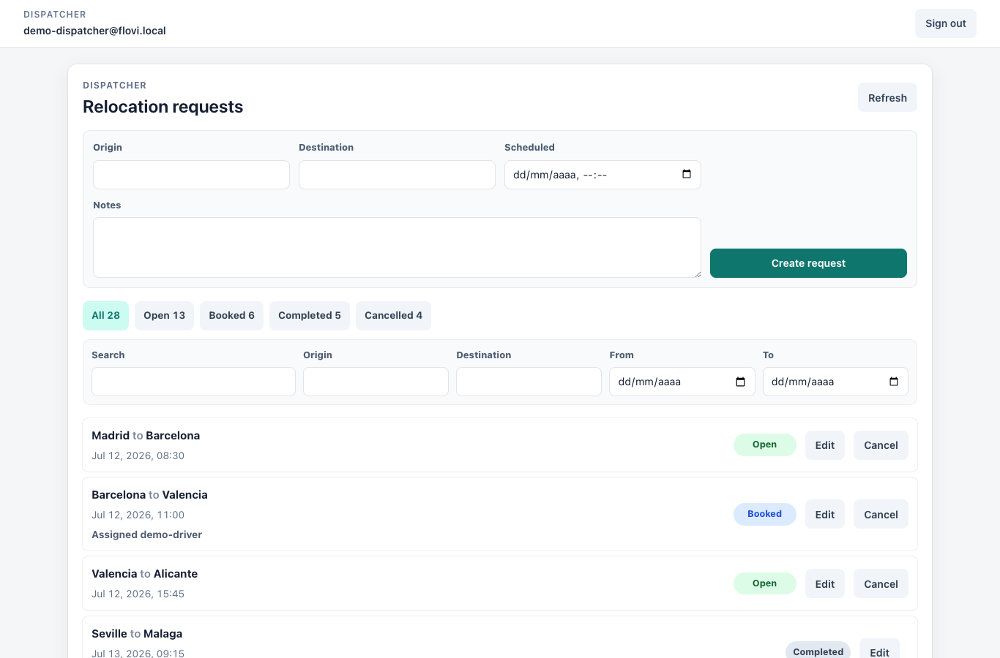
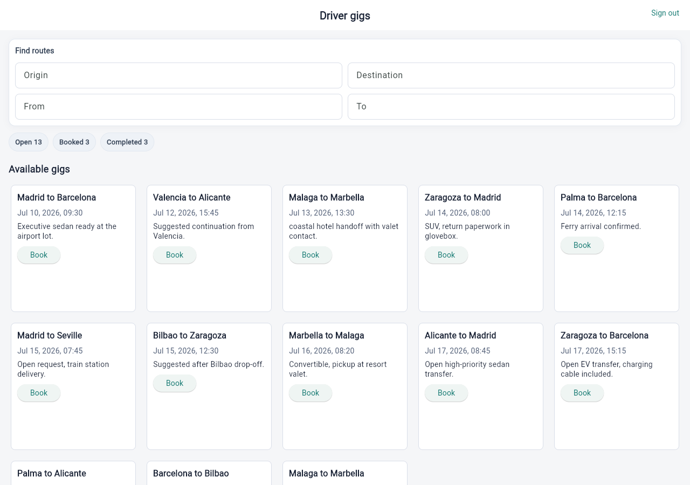

# Flovi AI Build Challenge

Production-minded demo for a vehicle relocation workflow. A dispatcher creates and manages relocation requests, while a driver browses, books, and completes available gigs.

## Live Demo

- Dispatcher: https://flovi-dispatcher.vercel.app
- Driver: https://flovi-driver.vercel.app
- Repository: https://github.com/txemaleon/flovi-ai-build-challenge

## What It Includes

- Vue 3 dispatcher app with Google OAuth through Supabase.
- Flutter driver app, deployed as Flutter Web for the live demo.
- Supabase auth, Postgres persistence, realtime refresh, row-level security, and lifecycle guards.
- Google OAuth configured through Supabase providers.
- Spain-wide demo relocation data covering open, booked, completed, and cancelled states.
- CI verification through GitHub Actions.
- Prompt/delivery log, task board, walkthrough script, and reflection notes.

## Product Flow

Dispatcher users can:

- Sign in with Google.
- Create relocation requests with origin, destination, scheduled date/time, and notes.
- List every request with clear status indicators.
- Filter by status, place, date window, and search text.
- Edit existing requests.
- Cancel available or booked requests.

Driver users can:

- Sign in with Google.
- Browse available unbooked gigs.
- Filter gigs by origin, destination, and pickup date window.
- See suggested next gigs based on the destination of the latest booked or completed trip.
- Book gigs with one action.
- View booked and completed gigs.
- Complete booked gigs.

## Architecture

The repo uses a small monorepo structure:

```text
apps/
  dispatcher/      Vue 3 + Vite web app
  driver/          Flutter app, deployed as Flutter Web
packages/
  core/            Relocation domain, use cases, ports, adapters, demo data
supabase/
  migrations/      Authenticated schema, RLS, realtime, lifecycle guards
scripts/
  seed-supabase-demo-data.mjs
docs/
  prompt-log.md
  task-board.md
  deployment.md
  demo-smoke-checklist.md
  walkthrough-script.md
  reflection.md
```

The domain logic lives in `packages/core/src/relocations`, with application use cases and repository ports separated from Supabase and UI details. Runtime-specific code is kept in app-level composition layers.

## Tech Stack

- Dispatcher: Vue 3, Vite, TypeScript, Tailwind CSS.
- Driver: Flutter 3, Supabase Flutter.
- Backend: Supabase Auth, Postgres, Realtime, Row Level Security.
- Hosting: Vercel for both public web demos.
- Testing: Vitest for TypeScript, Flutter tests through Docker, GitHub Actions for CI.

## Local Verification

Install dependencies:

```sh
npm install
```

Run the full verification set:

```sh
npm test
npm run coverage
npm run typecheck
npm run driver:test
npm run driver:build
```

The TypeScript-owned packages are kept at 100% coverage. Driver verification uses the Docker-backed Flutter scripts so Flutter does not need to be installed directly on the host.

## Environment

Copy the example file and fill the public runtime values:

```sh
cp .env.example .env
```

Google OAuth client secrets are not committed and are not needed in client env vars. They belong only in the Supabase Google provider configuration.

See [docs/deployment.md](docs/deployment.md) for Supabase, OAuth, seed, and Vercel setup details.

## Delivery Notes

- Prompt and delivery trace: [docs/prompt-log.md](docs/prompt-log.md)
- Task board: [docs/task-board.md](docs/task-board.md)
- Demo smoke checklist: [docs/demo-smoke-checklist.md](docs/demo-smoke-checklist.md)
- Walkthrough script: [docs/walkthrough-script.md](docs/walkthrough-script.md)
- Reflection: [docs/reflection.md](docs/reflection.md)
- Presentation prep: [docs/presentation-prep.md](docs/presentation-prep.md)

## Screenshots




